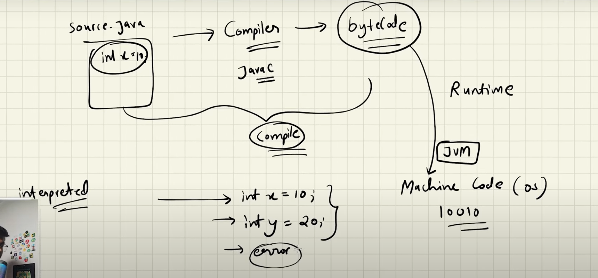

### Java is interpreted and compiled language

### JVM is Java Virtual Machine - gives us platform independencies and thread safety
The Java Virtual Machine (JVM) is an abstract computing machine that enables a computer to run Java programs. It provides a runtime environment to execute Java bytecode, which is the intermediate representation of Java code, compiled from the source code. The JVM performs several critical functions:

1. **Class Loader**: Loads class files into memory and performs verification, preparation, and resolution of classes.
2. **Bytecode Verifier**: Ensures that the bytecode is valid and adheres to Java’s security constraints.
3. **Execution Engine**: Converts bytecode into machine code and executes it. There are three main execution strategies:
   - **Interpreter**: Interprets bytecode instructions one at a time.
   - **Just-In-Time (JIT) Compiler**: Compiles parts of the bytecode into native machine code for better performance.
4. **Garbage Collector**: Manages memory by automatically reclaiming memory occupied by objects that are no longer in use.
5. **Runtime Environment**: Provides core libraries and system resources necessary for running Java applications.

JIT(Just-In-Time) is a technique used by the JVM to compile bytecode to native machine code, which can improve performance. It can be enabled by setting the -XX:+UnlockExperimentalVMOptions flag in the JVM options.

The JVM is platform-independent, meaning that the same Java program can run on any device that has a JVM implementation, making Java a "write once, run anywhere" language.

- A Running Program is a Process. Program is set of Instructions.
### Heap and Stack in JVM, RAM, and Threads

In the context of the JVM, RAM, and threads, the heap and stack are two distinct memory areas used for different purposes:

1. **Heap:**
   - **JVM Usage:** The heap is a shared memory area used by the JVM for dynamic memory allocation. All Java objects and their instance variables are allocated memory on the heap. It is managed by the garbage collector, which reclaims memory used by objects that are no longer accessible or needed.
   - **RAM Usage:** The heap resides in the RAM and is a part of the memory allocated to the JVM process. Its size can be adjusted using JVM options such as `-Xmx` to specify the maximum heap size.
   - **Threads Usage:** The heap is shared among all threads in a Java application. This shared usage requires synchronization mechanisms to prevent concurrent access issues, ensuring thread safety when multiple threads interact with objects on the heap.

2. **Stack:**
   - **JVM Usage:** The stack is a memory area used for storing method call details, including local variables, method parameters, and the call stack itself. Each thread in a Java application has its own stack, which is created at the thread's inception.
   - **RAM Usage:** The stack is a part of the RAM allocated to the JVM, but it is distinct from the heap. The size of each thread's stack can be adjusted with the `-Xss` JVM option.
   - **Threads Usage:** Since each thread has its own stack, there is no need for synchronization when accessing stack data. The stack is used for managing function calls and execution context, allowing threads to operate independently and efficiently.

In summary, the heap and stack serve different purposes: the heap is for dynamic object storage shared among threads, while the stack is for method execution and local variable storage, unique to each thread. Managing these memory areas efficiently is crucial for optimal JVM performance and application stability.

### Static means directly loaded on memory. Static function doesn't depend on instance of class (creation of object) to be called. It can be called without creating object of that class.