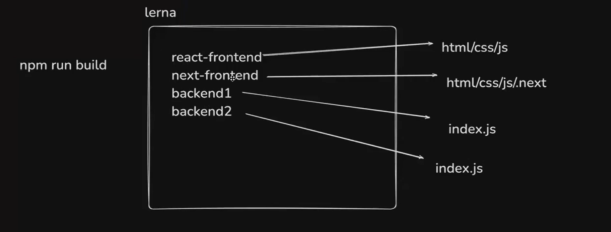
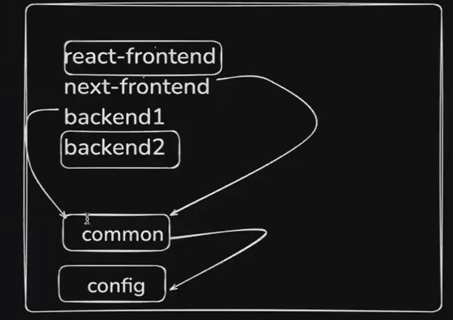
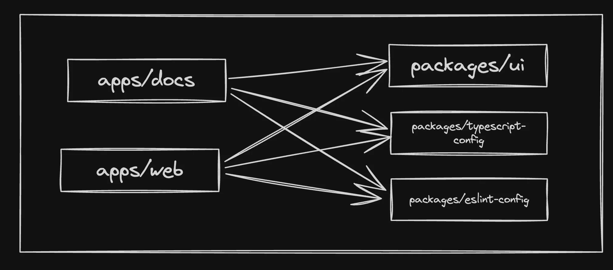

### What are monorepos?

A monorepo is a single repository that holds all of your frontend, backend, and devops code.

### Why not Simple folders?

Why cant I just store services (backend, frontend etc) in various top level folders?

You can, and you should if your

1. Services are highly decoupled (dont share any code)
2. Services don’t depend on each other.

For eg - A codebase which has a Golang service and a JS service

### Why Monorepos?

Monorepos can help you keep your codebase clean and organized. They can also help you to manage your dependencies more effectively.


1. **Shared Code Reuse**
2. **Enhanced Collaboration**
3. **Optimized Builds and CI/CD**: Tools like TurboRepo offer smart caching and task execution strategies that can significantly reduce build and testing times.
4. **Centralized Tooling and Configuration**: Managing build tools, linters, formatters, and other configurations is simpler in a monorepo because you can have a single set of tools for the entire project.
   

### Common monorepo framework in Node.js

1. Lerna - https://lerna.js.org/
2. nx - https://github.com/nrwl/nx
3. Turborepo - https://turbo.build/ — Not exactly a monorepo framework. It is build on top of the existing monorepo framework. It can work with multiple frameworks.
4. Yarn/npm workspaces - https://classic.yarnpkg.com/lang/en/docs/workspaces/

#### Note: Turborepo is a build system orchestrator which means it is a tool that helps you automate the task of building, testing and deploying your code.

### Build system vs Build system orchestrator vs Monorepo framework:

#### **Build System**

A build system automates the process of transforming source code written by developers into binary code that can be executed by a computer. For JavaScript and TypeScript projects, this process can include transpilation (converting TS to JS), bundling (combining multiple files into fewer files), minification (reducing file size), and more. A build system might also handle running tests, linting, and deploying applications.

##### Example of a Build System: Vite

Vite is a modern build tool that provides an extremely fast development environment and optimized production builds. It is particularly popular for its lightning-fast HMR (Hot Module Replacement) and support for modern JavaScript features.

###### Key Features:

- **Instant Server Start**: Vite leverages native ES modules in the browser to provide a near-instant server start.
- **Lightning-Fast HMR**: Updates are applied over native ESM, resulting in fast updates.
- **Optimized Build**: Vite uses Rollup under the hood for production builds, ensuring efficient code splitting and minification.

###### Basic Usage:

1. Install Vite using npm or yarn:

   ```bash
   npm init vite@latest my-project
   cd my-project
   npm install
   ```

2. Start the Vite development server:

   ```bash
   npm run dev
   ```

3. Build for production:

   ```bash
   npm run build
   ```

4. Preview the production build locally:
   ```bash
   npm run serve
   ```

##### Example of a Build System: Webpack

Webpack is a widely-used build tool that bundles JavaScript files for usage in a browser. It is known for its flexibility and capability to handle complex build setups.

###### Key Features:

- **Code Splitting**: Webpack can split code into separate chunks, which can be loaded on demand.
- **Loaders**: Allows you to preprocess files as you `require()` or "load" them.
- **Plugins**: Offer a powerful way to handle tasks like bundle optimization, asset management, and injection of environment variables.

###### Basic Usage:

1. Install Webpack and Webpack CLI:

   ```bash
   npm install --save-dev webpack webpack-cli
   ```

2. Create a basic configuration file `webpack.config.js`:

   ```js
   const path = require("path");

   module.exports = {
     entry: "./src/index.js",
     output: {
       filename: "bundle.js",
       path: path.resolve(__dirname, "dist"),
     },
   };
   ```

3. Run the Webpack build:

   ```bash
   npx webpack --config webpack.config.js
   ```

##### Example of a Build System: Parcel

Parcel is a zero-config build tool that offers a fast and easy way to bundle applications.

###### Key Features:

- **Zero Configuration**: Automatically detects and configures build settings.
- **Hot Module Replacement**: Provides fast development with HMR.
- **Built-in Support**: Supports a wide range of file types out-of-the-box without requiring additional plugins.

###### Basic Usage:

1. Install Parcel:

   ```bash
   npm install -g parcel-bundler
   ```

2. Create an HTML file:

   ```html
   <!DOCTYPE html>
   <html>
     <body>
       <script src="index.js"></script>
     </body>
   </html>
   ```

3. Run the Parcel development server:

   ```bash
   parcel index.html
   ```

4. Build for production:

   ```bash
   parcel build index.html
   ```

#### **Build System Orchestrator**

TurboRepo acts more like a build system orchestrator rather than a direct build system itself. It doesn't directly perform tasks like transpilation, bundling, minification, or running tests. Instead, TurboRepo allows you to define tasks in your monorepo that call other tools (which are the actual build systems) to perform these actions.

These tools can include anything from tsc, vite etc

#### **Monorepo Framework**

A monorepo framework provides tools and conventions for managing projects that contain multiple packages or applications within a single repository (monorepo). This includes dependency management between packages, workspace configuration.

### Turborepo as a build system orchestrator:

Initialize Turborepo

````jsx
npx create-turbo@latest
```

```
Enable Remote Caching (recommended): `pnpm dlx turbo login`

To connect to your Remote Cache, run the following in any turborepo:
`npx turbo link`
```

Turborepo is a `build system orchestrator` .

The key feature of TurboRepo is its ability to manage and optimize the execution of these tasks across your monorepo. It does this through:


1. **Caching**: TurboRepo caches the outputs of tasks, so if you run a task and then run it again without changing any of the inputs (source files, dependencies, configuration), TurboRepo can skip the actual execution and provide the output from the cache. This can significantly speed up build times, especially in continuous integration environments.
2. **Parallelization**: It can run independent tasks in parallel, making efficient use of your machine's resources. This reduces the overall time needed to complete all tasks in your project.
3. **Dependency Graph Awareness**: TurboRepo understands the dependency graph of your monorepo. This means it knows which packages depend on each other and can ensure tasks are run in the correct order.

````

### Folder Structure of TurboRepo:

#### End user apps (websites/core backend)

1. `apps/web` - A Next.js website
2. `apps/docs` - A Docs website that has all the documentation related to your project

#### Helper packages

1. `packages/ui` - UI packages
2. `packages/typescript-config` - Shareable TS configuration
3. `packages/eslint-config` - Shareable ESLine configuration
   

#### Note - You don't import a component by relative path because it can be deployed independently. For example, if you want to use the `Input` component in your `web` app, you should import it like this: `import { Input } from '@repo/ui'`, and not like this: `import { Input } from '../../../packages/ui/src/components/Input'`. This is because the relative path can change depending on how the packages are deployed, and also because the `Input` component is a part of the `@repo/ui` package, which is a separate package from the `web` app.
