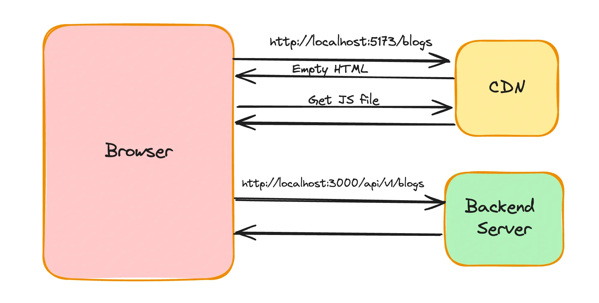
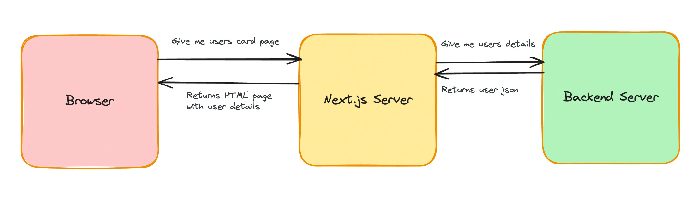

### Introduction to Next.js Backend

Next.js is a comprehensive framework that enables seamless development of both frontend and backend applications in a unified environment.

#### Benefits of Using Next.js

- **Unified Codebase**: Maintain both frontend and backend within a single codebase, simplifying development and management.
- **Eliminate CORS Issues**: With a single domain for both frontend and backend, cross-origin resource sharing (CORS) issues are mitigated.
- **Simplified Deployment**: Deploy your entire application as a single unit, streamlining the deployment process.

### Data Fetching in React -



### Data Fetching in Next.js -

You should fetch the user details on the server side and pre-render the page before returning it to the user.


#### Note - Whenever we use useState or hooks then we need to specify the component with `use client`. Marking it as a client side component.

#### Note - Next.js supports asynchronous components.

```tsx
import axios from "axios";

async function getUserDetails() {
  const response = await axios.get(
    "https://week-13-offline.kirattechnologies.workers.dev/api/v1/user/details"
  );
  return response.data;
}

export default async function Home() {
  const userData = await getUserDetails();

  return (
    <div>
      {userData.email}
      {userData.name}
    </div>
  );
}
```

### Loading in next.js

What if the getUserDetails call takes 5s to finish (lets say the backend is slow). You should show the user a loader during this time
loading.tsx file
Just like `page.tsx` and `layout.tsx` , you can define a skeleton.tsx file that will render until all the async operations finish

1. Create a `loading.tsx` file in the root folder
2. Add a custom loader inside

```tsx
export default function Loading() {
  return (
    <div className="flex flex-col justify-center h-screen">
      <div className="flex justify-center">Loading...</div>
    </div>
  );
}
```

### Introducing api routes in Next.js

The benefits of using Next.js for backend includes:

- Code in a single repo
- All standard things you get in a backend framework like express
- Server components can directly talk to the backend

#### Note - The default export function are imported like `import UserHandler from './UserHandler'; ` and the export function are imported as `import { GET } from './UserHandler'; `

We want to introduce a route that returns hardcoded values for a user’s details (email, name, id)

1. Introduce a new folder called api
2. Add a folder inside called user
3. Add a file inside called route.ts
4. Initialize a GET route inside it

```tsx
export async function GET() {
  return Response.json({ username: "shivam", email: "shivam@gmail.com" });
}
```

Try replacing the api call in page.tsx to hit this URL

```tsx
async function getUserDetails() {
  try {
    const response = await axios.get("http://localhost:3000/api/user")
	  return response.data;
  }  catch(e) {
    console.log(e);
  }
}
```
Not the best way to fetch the data from the server.