### NextJs Intro

=================

NextJS was a framework that was introduced because of some minor inconviniences in React

#### Note - In fact, React is not primarily a browser framework; it excels in efficiently managing and updating the UI by using a process called "reconciliation". Reconciliation is the process of determining what changes need to be made to the UI by comparing the previously rendered UI with the newly desired UI.React can be used to build mobile applications and web applications. For mobile applications we use "react-native" and for web applications we use "react-dom". And we need "react-router-dom" for doing routing in application components.

- In a React project, you have to maintain a separate Backend project for your API routes
- React does not provide out of the box routing (you have to use react-router-dom)
- React is not SEO Optimised
  - not exactly true today because of React Server components
  - we'll discuss soon why
- Waterfalling problem

#### SEO Optimisation

Google/Bing has a bunch of crawlers that hit websites and figure out what the website does.
It ranks it on Google based on the HTML it gets back
The crawlers DONT usually run your JS and render your page to see the final output.
While Googlebot can run JavaScript, dynamically generated content is harder for the scraper to index.

Try visiting a react website
What does the Googlebot get back when they visit a website written in react?
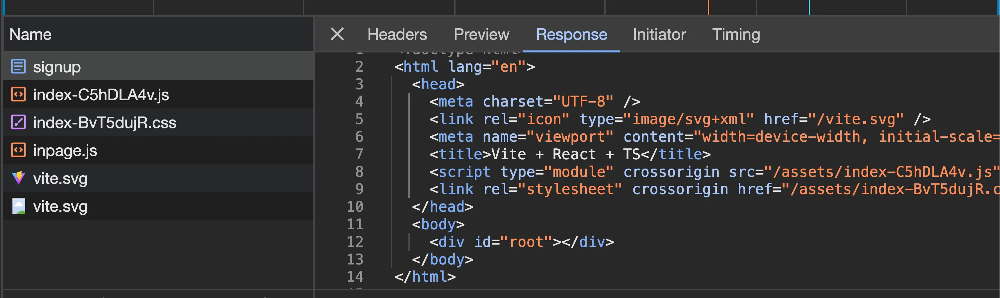
Googlebot has no idea on what the project is. It only sees Vite + React + TS in the original HTML response.
Ofcourse when the JS file loads eventually, things get rendered but the Googlebot doesn’t discover this content very well.

#### Waterfalling Problem

Let’s say you built a blogging website in react, what steps do you think the request cycle takes?
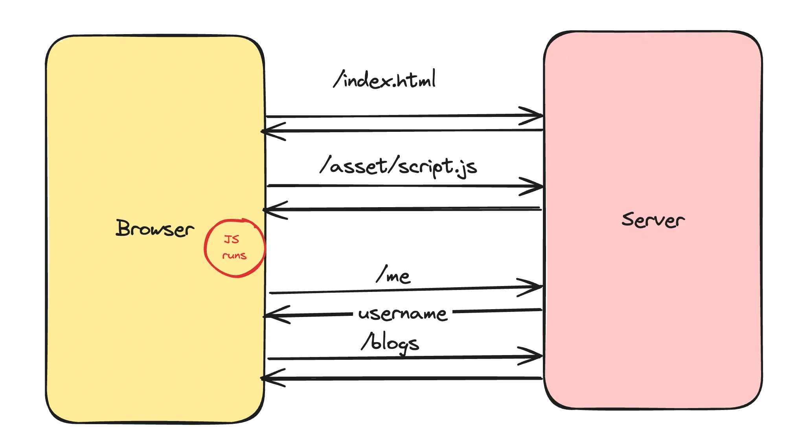

1. Fetching the index.html from the CDN
2. Fetching script.js from CDN
3. Checking if user is logged in (if not, redirect them to /login page)
4. Fetching the actual blogs

The "waterfalling problem" in React, and more broadly in web development, refers to a scenario where data fetching operations are chained or dependent on each other in a way that leads to inefficient loading behavior.

What does nextjs provide you?
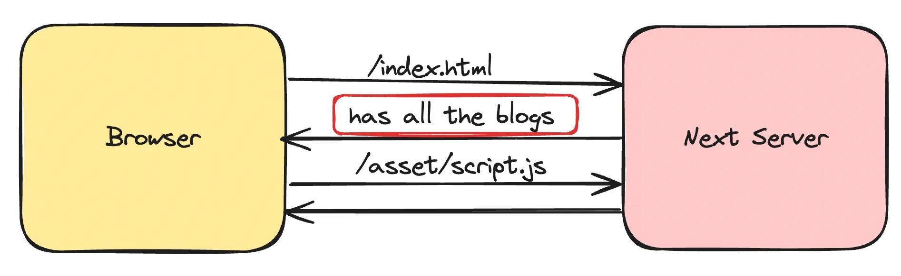

### Why nextjs?

Next.js offers several advantages over React:

- **Server-Side Rendering (SSR):** Improves SEO by rendering content on the server. React is CSR(Client Side Rendering) or CDN(Content Delivery Network) -> files server and Next.js provides SSR(Server Side Rendering).
- **Integrated API Routes:** Allows for a unified codebase combining frontend and backend.
- **File-Based Routing:** Eliminates the need for react-router-dom.
- **Optimized Bundling and Static Site Generation:** Enhances performance.
- **Backed by Vercel:** Ensures robust support and updates.

**Drawbacks:**

- **Requires Server:** Cannot be distributed via CDN, necessitating a server for SSR, which can be costly.
- **Highly Opinionated:** Makes it challenging to migrate away due to its specific conventions and structure.

#### Note - When we run `npm run build` in React, we build a bundle of file which is none other that the html, css and js files. In Next.js, this command builds a production-ready application with optimized server-side rendering, static site generation, and route pre-rendering.

#### Important - Next.js uses a file-based routing system. This means if you create a directory named `users` and within it a file named `page.tsx`, accessing the `/users` route will render the content of the `page.tsx` file.

### Routing in nextjs

Routing in React -
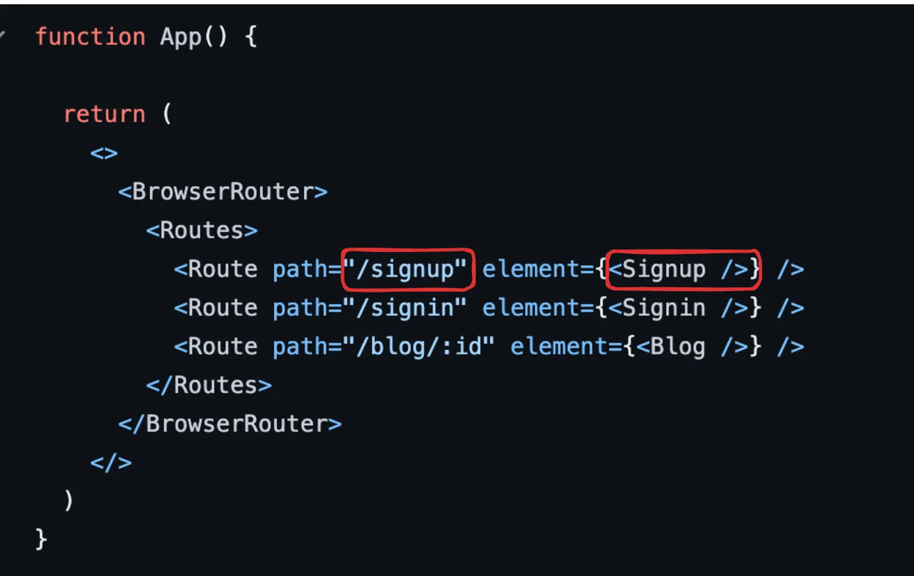

##### Next.js has a file based router. This means that the way you create your files, describes what renders on a route

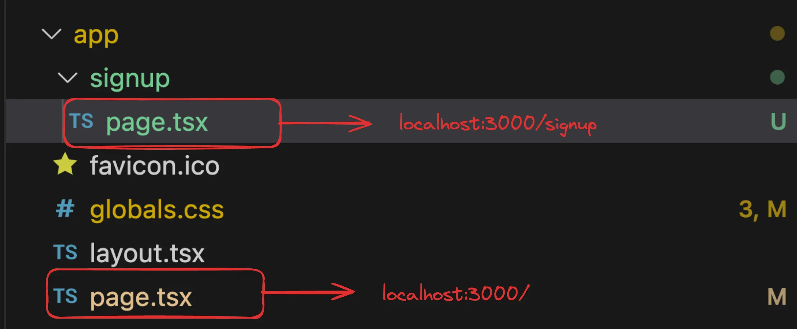
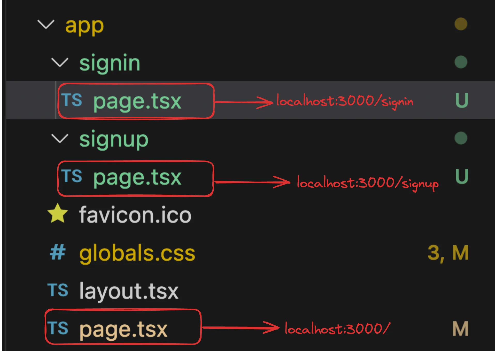

### Server Side Rendering (SSR) - Solves SEO optimization and waterfalling problem

1. Run npm run dev
2. Visit http://localhost:3000/signup
3. Notice the response you get back in your HTML file
   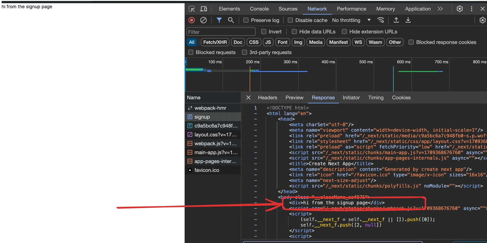
   Now if GoogleBot tries to scrape your page, it’ll understand that this is a signup page without running any Javascript.
   The first index.html file it get’s back will have context about the page since it was server side rendered

### Layouts - Layouts let you wrap all child pages inside some logic.

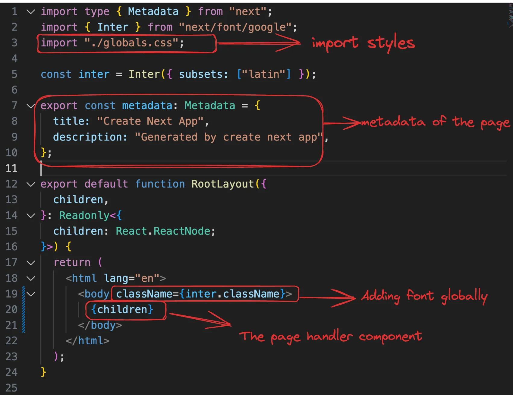

In Next.js, layouts are used to wrap multiple pages with a consistent design or functionality. A layout file is typically used to define elements that are common across multiple pages, such as a header, footer, or sidebar.

#### `layout.tsx` Usage

The `layout.tsx` file serves as a root component that can wrap around the content of each route. It ensures that all pages share a common structure or set of components. Here's an example of how `layout.tsx` can be structured:

```tsx
import type { Metadata } from "next";
import { Inter } from "next/font/google";
import "./globals.css";
import Navbar from "@/components/Navbar";

const inter = Inter({ subsets: ["latin"] });

export const metadata: Metadata = {
  title: "Create Next App",
  description: "Generated by create next app",
};

export default function RootLayout({
  children,
}: {
  children: React.ReactNode;
}) {
  return (
    <html lang="en">
      <body className={inter.className}>
        <Navbar />
        <main>{children}</main>
      </body>
    </html>
  );
}
```

In this example, the `RootLayout` component wraps the `Navbar` component and a `main` element around the `children` prop, which represents the child pages. This structure ensures that the `Navbar` is present on every page rendered within this layout.

###### In React, we can achieve the same by using the `Outlet` component from `react-router-dom`. The `Outlet` component serves as a placeholder for the child routes that are rendered inside a parent route. When a child route is matched, the `Outlet` component is replaced with the rendered content of the child route. This allows us to share a common layout between multiple pages, similar to how Next.js uses layouts.

#### Layouts in sub routes

What if you want all routes that start with `/signin` to have a banner that says "Login now to get 20% off"

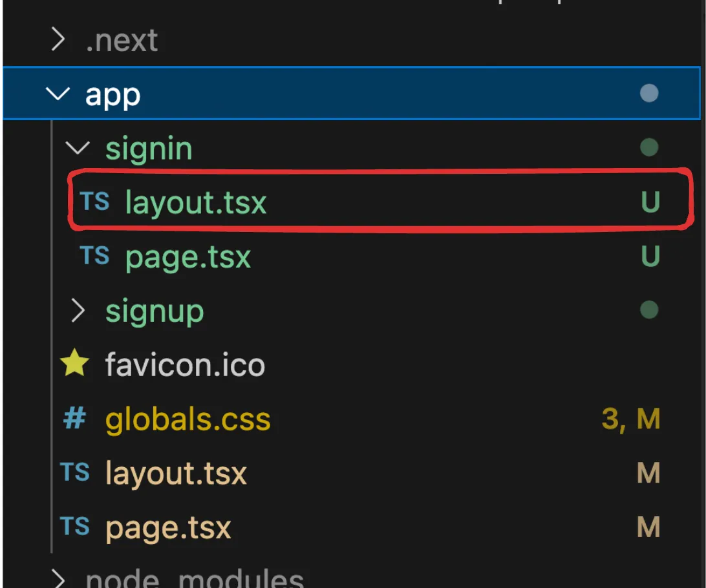

#### Merging routes

What if you want to get the banner in both signup and signin?

##### Approach #1

Move both the signin and signup folder inside a auth folder where we have the layout

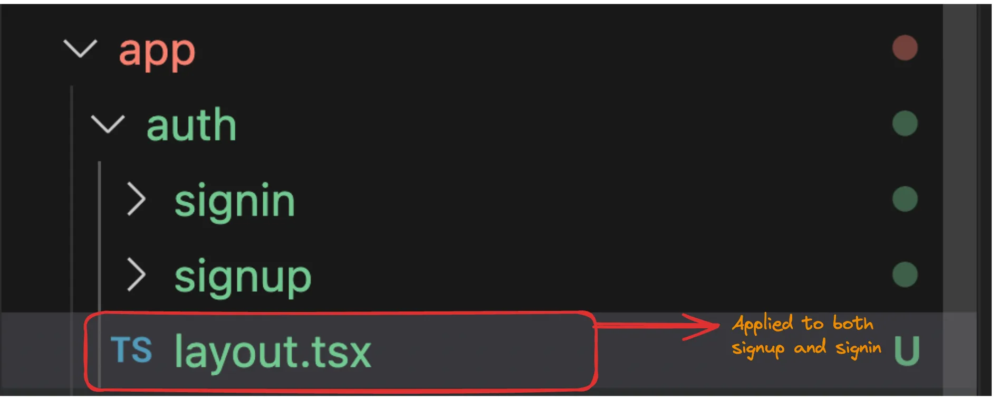

You can access the routes at
http://localhost:3000/auth/signup and http://localhost:3000/auth/signin

##### Approach #2

You can use create a new folder with `()` around the name.
This folder is ignored by the router.

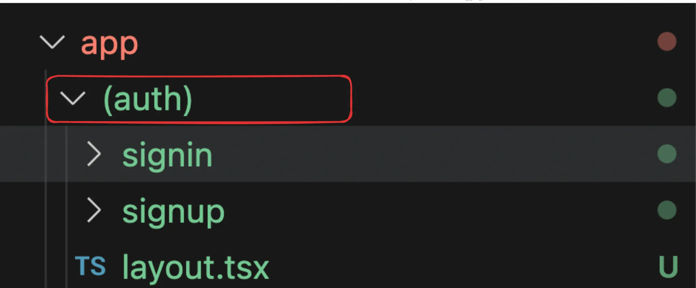

You can access the routes at
http://localhost:3000/signup and http://localhost:3000/signin

#### Structure

You should put all your components in a `components` directory and use them in the app routes rather than shoving everything in the route handler

- Create a new folder called `components` in the root of the project
- Add a new component there called `Signin.tsx`
- Move the signin logic there
- Render the `Signin` component in `app/(auth)signin/page.tsx`

```tsx
export function Signin() {
  return (
    <div className="h-screen flex justify-center flex-col">
      <div className="flex justify-center">
        <a
          href="#"
          className="block max-w-sm p-6 bg-white border border-gray-200 rounded-lg shadow hover:bg-gray-100 "
        >
          <div>
            <div className="px-10">
              <div className="text-3xl font-extrabold">Sign in</div>
            </div>
            <div className="pt-2">
              <LabelledInput
                label="Username"
                placeholder="harkirat@gmail.com"
              />
              <LabelledInput
                label="Password"
                type={"password"}
                placeholder="123456"
              />
              <button
                type="button"
                className="mt-8 w-full text-white bg-gray-800 focus:ring-4 focus:ring-gray-300 font-medium rounded-lg text-sm px-5 py-2.5 me-2 mb-2"
              >
                Sign in
              </button>
            </div>
          </div>
        </a>
      </div>
    </div>
  );
}

interface LabelledInputType {
  label: string;
  placeholder: string;
  type?: string;
}

function LabelledInput({ label, placeholder, type }: LabelledInputType) {
  return (
    <div>
      <label className="block mb-2 text-sm text-black font-semibold pt-4">
        {label}
      </label>
      <input
        type={type || "text"}
        id="first_name"
        className="bg-gray-50 border border-gray-300 text-gray-900 text-sm rounded-lg focus:ring-blue-500 focus:border-blue-500 block w-full p-2.5"
        placeholder={placeholder}
        required
      />
    </div>
  );
}
```

```tsx
import { Signin as SigninComponent } from "@/components/Signin";

export default function Signin() {
  return <SigninComponent />;
}
```

### Client and server components

Next.js requires you to specify your components as either client or server components. As the names imply:

- Server components are rendered on the server.
- Client components are pre-rendered and then sent to the client for rendering.

By default, components are server components. To designate a component as a client component, add the following at the top of the component file:

```
"use client"
```

##### When to Create Client Components?

- **Error Prompt:** When you encounter an error indicating the necessity of a client component.
- **Server Limitations:** When utilizing features like `useEffect`, `useState`, or `onClick` that are not server-compatible.
- **Best Practice:** Aim to defer client components as much as possible.
