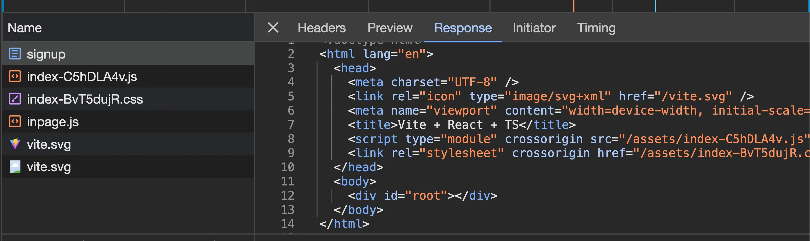
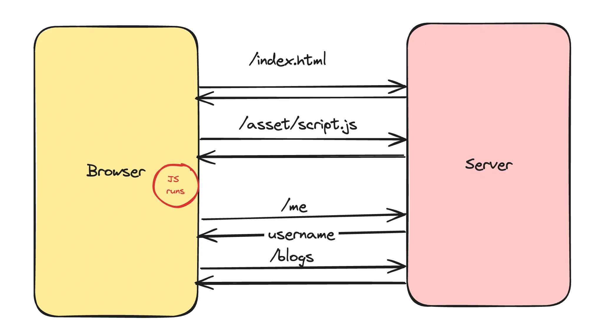
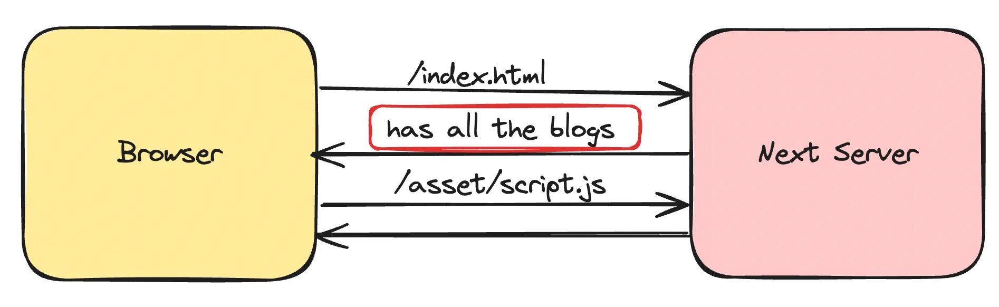

### NextJs Intro

=================

NextJS was a framework that was introduced because of some minor inconviniences in React

#### Note - In fact, React is not primarily a browser framework; it excels in efficiently managing and updating the UI by using a process called "reconciliation". Reconciliation is the process of determining what changes need to be made to the UI by comparing the previously rendered UI with the newly desired UI.React can be used to build mobile applications and web applications. For mobile applications we use "react-native" and for web applications we use "react-dom". And we need "react-router-dom" for doing routing in application components.

- In a React project, you have to maintain a separate Backend project for your API routes
- React does not provide out of the box routing (you have to use react-router-dom)
- React is not SEO Optimised
  - not exactly true today because of React Server components
  - we'll discuss soon why
- Waterfalling problem

#### SEO Optimisation

Google/Bing has a bunch of crawlers that hit websites and figure out what the website does.
It ranks it on Google based on the HTML it gets back
The crawlers DONT usually run your JS and render your page to see the final output.
While Googlebot can run JavaScript, dynamically generated content is harder for the scraper to index.

Try visiting a react website
What does the Googlebot get back when they visit a website written in react?

Googlebot has no idea on what the project is. It only sees Vite + React + TS in the original HTML response.
Ofcourse when the JS file loads eventually, things get rendered but the Googlebot doesn’t discover this content very well.

#### Waterfalling Problem

Let’s say you built a blogging website in react, what steps do you think the request cycle takes?

1. Fetching the index.html from the CDN
2. Fetching script.js from CDN
3. Checking if user is logged in (if not, redirect them to /login page)
4. Fetching the actual blogs

The "waterfalling problem" in React, and more broadly in web development, refers to a scenario where data fetching operations are chained or dependent on each other in a way that leads to inefficient loading behavior.

What does nextjs provide you?

### Why nextjs?

Next.js offers several advantages over React:

- **Server-Side Rendering (SSR):** Improves SEO by rendering content on the server. React is CSR(Client Side Rendering) and Next.js provides SSR(Server Side Rendering).
- **Integrated API Routes:** Allows for a unified codebase combining frontend and backend.
- **File-Based Routing:** Eliminates the need for react-router-dom.
- **Optimized Bundling and Static Site Generation:** Enhances performance.
- **Backed by Vercel:** Ensures robust support and updates.

**Drawbacks:**

- **Requires Server:** Cannot be distributed via CDN, necessitating a server for SSR, which can be costly.
- **Highly Opinionated:** Makes it challenging to migrate away due to its specific conventions and structure.
