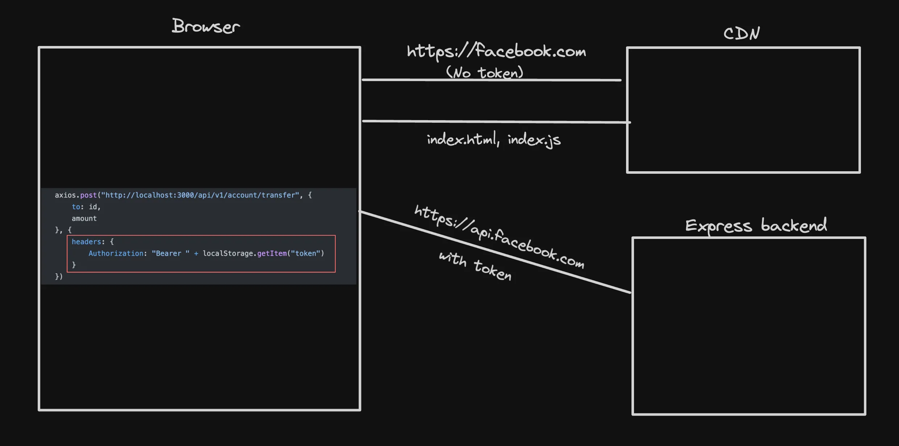
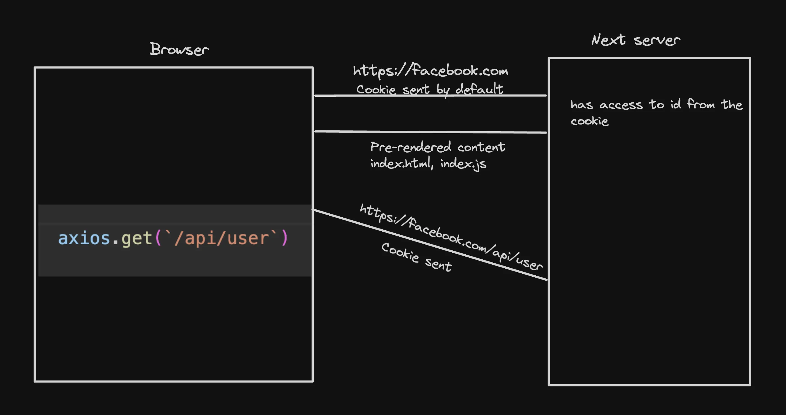

## NextAuth

### What is next auth?

NextAuth.js is an open-source authentication solution for Next.js applications. It provides a flexible and easy way to implement authentication in your application, supporting various authentication providers like Google, Facebook, Twitter, GitHub, and more. It also supports email/password authentication, JWT sessions, and database sessions, making it highly adaptable to different needs. With NextAuth.js, you can easily manage user sessions and secure your application.

### Can you do it without next-auth?

Yes, you can implement authentication without using NextAuth.js. However, you should be aware of the potential complexity and security implications of doing so.

### Popular choices for authentication

- External providers:
  - Auth0
  - Clerk
  - Firebase auth
- In-house solutions:
  - Using cookies
- NextAuth.js

### What is oAuth?

OAuth is an authorization protocol that enables applications to obtain limited access to user accounts on another service provider's website, without requiring the user to share their login credentials.

For example, let's say you want to use a third-party application to post a tweet on your behalf. Instead of giving the application your Twitter login credentials, you can use OAuth to give the application a limited access to your Twitter account. The application will then be able to post a tweet on your behalf without having access to your login credentials.

### How does OAuth protocol work?

OAuth protocol works as follows:

1. The user requests authorization to access their account on the service provider's website.
2. The service provider redirects the user to an authorization page.
3. The user grants permission to access their account data.
4. The service provider redirects the user back to the application with an authorization code.
5. The application requests an access token from the service provider, using the authorization code.
6. The service provider verifies the authorization code and issues an access token.
7. The application uses the access token to access the user's account data.

### Why we can't use local storage for authentication in next.js?

Local storage is not secure for storing sensitive information like authentication tokens. This is because:

1. Local storage is accessible by any JavaScript code running on the same domain.
2. Local storage is not encrypted.
3. Local storage is vulnerable to XSS attacks.

In Next.js, you should use server-side sessions instead of local storage. This is because sessions are stored on the server, making it harder for an attacker to access the sensitive information. Additionally, sessions are encrypted and can be made secure against XSS attacks.

### Why not use JWT + localstorage?

While JWT + localstorage may seem like a simple solution for authentication, it is not secure. This is because:

1. JWTs are not encrypted, so an attacker can read the contents of the token.
2. Local storage is accessible by any JavaScript code running on the same domain.
3. Local storage is vulnerable to XSS attacks.

Therefore, it is not recommended to use JWT + localstorage for authentication in a Next.js application. Instead, you should use server-side sessions.

Express app -


Next app -


#### Example:

```js
// app/page.js - Server Component
export default async function Page() {
  // This code runs only on the server
  const data = await fetch("https://api.example.com/data");
  const posts = await data.json();

  return (
    <main>
      <h1>My Posts</h1>
      {posts.map((post) => (
        <article key={post.id}>{post.title}</article>
      ))}
    </main>
  );
}

// app/server-components/LoginFormServer.js
import React from "react";

export default async function LoginFormServer() {
  // Server-side logic here (if needed)
  // For example, fetching data from a database

  const handleSubmit = async (event) => {
    event.preventDefault();
    const formData = new FormData(event.currentTarget);
    const response = await fetch("/api/login", {
      method: "POST",
      body: formData,
    });
    if (!response.ok) {
      return alert("Invalid credentials");
    }
    const data = await response.json();
    // Do something with the data, like redirecting to a new page
    window.location.href = "/dashboard";
  };

  return (
    <form onSubmit={handleSubmit}>
      <input type="email" name="email" required />
      <input type="password" name="password" required />
      <button type="submit">Login</button>
    </form>
  );
}

```

Server Components:

- Run only on the server, never in the browser
- Can directly access server resources (databases, file system)
- Can't use React hooks or browser APIs
- Don't send React component code to the client, only the HTML result
- Can't have event listeners (onClick, etc.)

```jsx
"use client"; // This directive marks it as a Client Component

// app/components/LoginForm.js
import { useState } from "react";

export default function LoginForm() {
  const [email, setEmail] = useState("");
  const [password, setPassword] = useState("");

  const handleSubmit = async (e) => {
    e.preventDefault();
    // Client-side form submission logic
  };

  return (
    <form onSubmit={handleSubmit}>
      <input
        type="email"
        value={email}
        onChange={(e) => setEmail(e.target.value)}
      />
      <input
        type="password"
        value={password}
        onChange={(e) => setPassword(e.target.value)}
      />
      <button type="submit">Login</button>
    </form>
  );
}
```

Client Components:

- Start on the server but hydrate and run in the browser
- Can use hooks, state, effects, and browser APIs
- Can have event listeners and handle interactions
- Send React component code to the browser

#### Why JWT in localStorage is Problematic - Using JWT tokens stored in localStorage for authentication has several security issues:

```jsx
"use client";

// UNSAFE approach - storing JWT in localStorage
function loginUser(credentials) {
  fetch("/api/login", {
    method: "POST",
    body: JSON.stringify(credentials),
  })
    .then((res) => res.json())
    .then((data) => {
      // PROBLEM: This token is vulnerable to XSS attacks
      localStorage.setItem("token", data.token);
    });
}

// app/server-components/FetchUserData.js
export default async function FetchUserData() {
  // Attempting to access localStorage in a server component
  // This will result in an error since localStorage is not available on the server

  try {
    const token = localStorage.getItem("token"); // This will cause an error
    console.log("Token:", token);
  } catch (error) {
    console.error("Error accessing localStorage:", error.message);
  }

  return <div>Check console for errors</div>;
}
```

The primary issues are:

#### Note - Can't access local storage in server side component. Because localstorage doens't exist in server. Local storage exist in browser side or client side.

- Vulnerable to XSS (Cross-Site Scripting): Any JavaScript running on your site can access localStorage and steal the token
- No automatic security features: Unlike cookies, localStorage:

- Has no HttpOnly flag option
- Has no Secure flag option
- Has no SameSite attribute
- Cannot be restricted from JavaScript access

### Solution - NextAuth

- Providers are services that allow users to authenticate with your application.
- Providers implement the strategy for authentication.
- Providers have a unique id.
- Providers can be configured to work with NextAuth.

It supports various providers:

- Login with email
- Login with google
- Login with facebook

### useSession Hook - The useSession() React Hook in the NextAuth.js client is the easiest way to check if someone is signed in.

- It should be used in the client side.
  -Make sure that <SessionProvider> is added to pages/\_app.js.
- The `useSession` hook from NextAuth can be used to get the user session in client-side components.
- The hook returns the session object which contains the user's data and the authentication status.
- It can be used to conditionally render components based on the user's authentication status.
- If the session is not available, the hook will return `null`.

useSession Example: client side authentication (this is client side rendering)

```tsx
"use client";
import { SessionProvider, signIn, signOut, useSession } from "next-auth/react";

export default function Home() {
  return (
    <SessionProvider>
      <RealHome />
    </SessionProvider>
  );
}

function RealHome() {
  const session = useSession();

  return (
    <div className="flex items-center justify-center">
      <button
        className="bg-blue-500 hover:bg-blue-700 text-white font-bold py-2 px-4 rounded"
        onClick={() => {
          if (session.status === "authenticated") {
            signOut();
          } else {
            signIn();
          }
        }}
      >
        {session.status === "authenticated" ? "Logout" : "Login"}
      </button>
    </div>
  );
}
```

server side rendering example -

```tsx
import { getServerSession } from "next-auth";

//server side rendering
export default async function Home() {
  const session = await getServerSession();

  return (
    <div>
      <h1>Welcome to Home Page</h1>
      <p>Session: {JSON.stringify(session)}</p>
    </div>
  );
}
```
